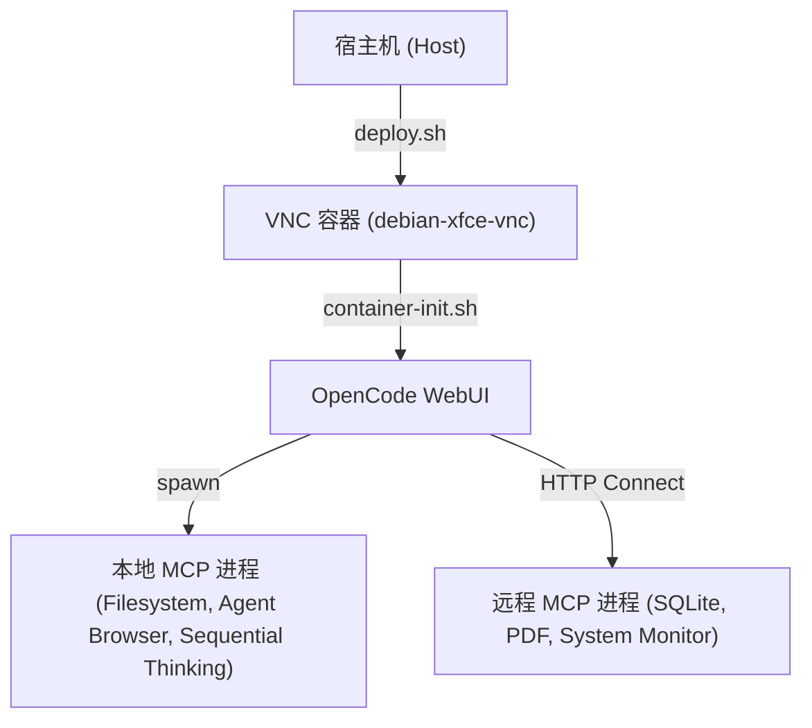

# 架构设计文档 - MCP 与开发环境配置

本文档描述了 Debian Xfce VNC 容器开发环境的 MCP (Model Context Protocol) 架构设计，以及最近的配置与依赖修复。

## 1. 架构概览

开发环境由宿主机（Host）和 Docker 容器（Container）组成。
- 宿主机通过 `deploy.sh` 脚本管理容器的生命周期与端口映射。
- 容器内部运行 `OpenCode WebUI` 服务，负责提供 AI 开发交互界面。
- MCP 服务分为 **Local**（本地加载进程）和 **Remote**（外部独立 HTTP 服务监听）两类服务。

---

## 2. 关键服务及运行配置

### 2.1 Node.js 运行环境 (Node 22 LTS)
- **现状与问题**：基础镜像自带的 Node.js 版本为 `v20.20.2`，该版本与较新版本的 `undici` 依赖存在严重的 WebIDL API 冲突（报错 `TypeError: webidl.util.markAsUncloneable is not a function`），导致 SQLite MCP 服务编译构建失败。
- **解决方案**：在容器初始化脚本 `container-init.sh` 中，增加了检测 Node.js 版本并自动升级至 Node 22 LTS (NodeSource) 的逻辑。

### 2.2 SQLite MCP 存储服务
- **包名称**：`@pepk/mcp-memory-sqlite`
- **运行模式**：Local (由 OpenCode 自动拉起，使用 Stdio 管道)。
- **持久化路径**：`/headless/.config/opencode/opencode.sqlite`

### 2.3 浏览器自动化策略
- **现状**：`puppeteer` 本地 MCP 服务已从默认 OpenCode 配置中移除，以避免不必要的浏览器进程和容器资源浪费。
- **替代方案**：使用 `agent-browser` 作为首选浏览器自动化引擎，并将其注册为 OpenCode 的本地 MCP 服务。
- **优点**：`agent-browser` 提供更现代的浏览器自动化语义接口，减少 root 容器下的沙箱配置风险，同时支持按需启动。

### 2.4 OpenCode 插件管理与优化
- **运行模式**：在 `/headless/.opencode/` 目录下管理全局 Node 项目及其 `node_modules`。
- **现状与问题**：
  - 原有机制通过 `opencode plugin <git-url>` 逐个安装 Git-based 插件，因 OpenCode 内部的 npm 包管理器对 Git 依賴處理有 Bug，經常報錯 `git dep preparation failed` 且耗時長。
  - 安裝後在 WebUI 面板會直接顯示含有 Git 網址的冗長套件名稱，視覺效果不夠精簡高級。
- **解决方案**：
  - 改用批量聲明依賴並在 `/headless/.opencode/` 執行 `bun install`。這會以 100% 成功率且數秒內完成所有插件及原生依賴的極速載入。
  - 將寫入 `/headless/.opencode/plugins.json` 的清單精簡為純淨、無網址的簡短包名。重啟 OpenCode 後，WebUI 即可載入命名乾淨、高雅清爽的插件列表。

### 2.5 Agent-Browser 浏览器自动化集成
- **目标**：将 `vercel-labs/agent-browser` 作为独立浏览器自动化引擎，注册为 OpenCode 的本地 MCP 服务器，从而使 OpenCode 能够直接驱动浏览器交互与网络自动化。
- **集成方式**：
  1. 在 `config/setup_agent_browser.py` 中自动下载 `agent-browser` 发行版二进制，并执行 `agent-browser install --with-deps` 以安装 Chromium 运行时依赖。
  4. 在 `config/setup_mcp.py` 中检测到 `agent-browser` 二进制后，将其加入 MCP servers，使用 `agent-browser mcp --tools core,network,react` 启动本地 MCP 服务。
  5. 在 `config/setup_skill.py` 中将 `agent-browser` 纳入 Skill 清单，使 OpenCode WebUI 可以在技能列表中展示该能力。
  6. `config/container-init.sh` 已调整为模块化启动顺序：先通过 `python3 setup_agent_browser.py` 安装 agent-browser，再通过 `python3 setup_mcp.py` 写入 MCP 配置，随后执行 `setup_plugin.py` 与 `setup_skill.py`，最后在 `tmux` 会话中启动 OpenCode WebUI，保证 MCP 服务在 WebUI 启动前就绪。
- **运行优势**：
  - 使 OpenCode 除 Puppeteer 之外，拥有一个更现代、系统集成更好的浏览器自动化工具。
  - 通过 `agent-browser mcp` 获取结构化 MCP tool 语义，支持更精细的网络、元素交互与 React 调试工作流。

### 2.6 OpenCode 版本控制与 CLI 部署
- **运行模式**：在 `container-init.sh` 中的 `setup_opencode` 函数中处理。
- **配置与优势**：
  - 自动检测并精准锁定 OpenCode CLI 核心版本为 `v1.18.18`（设置 `OPENCODE_TARGET_VERSION="1.18.18"`），防止 CLI 自动升级导致版本漂移，提供完整的插件生态与最佳稳定性。
  - 自动配置软链接 `/usr/bin/opencode -> /headless/.opencode/bin/opencode`，保证命令行环境与后台 WebUI 服务无缝调用，且端口 4096 WebUI 稳定流畅无阻。
