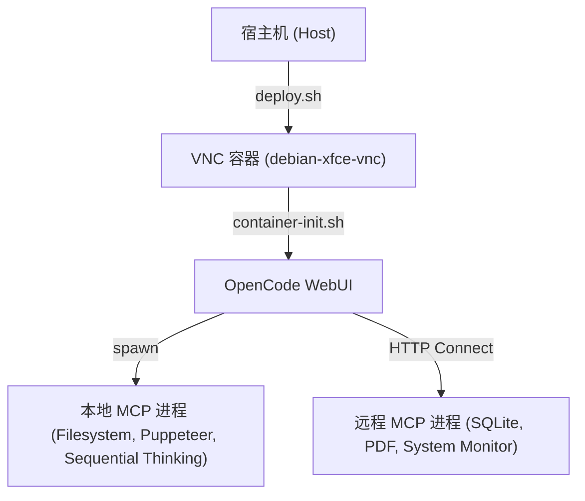

# 架构设计文档 - MCP 与开发环境配置

本文档描述了 Debian Xfce VNC 容器开发环境的 MCP (Model Context Protocol) 架构设计，以及最近的配置与依赖修复。

## 1. 架构概览

开发环境由宿主机（Host）和 Docker 容器（Container）组成。
- 宿主机通过 `deploy.sh` 脚本管理容器的生命周期与端口映射。
- 容器内部运行 `OpenCode WebUI` 服务，负责提供 AI 开发交互界面。
- MCP 服务分为 **Local**（本地加载进程）和 **Remote**（外部独立 HTTP 服务监听）两类服务。

---

## 2. 关键服务及运行配置

### 2.1 Node.js 运行环境 (Node 22 LTS)
- **现状与问题**：基础镜像自带的 Node.js 版本为 `v20.20.2`，该版本与较新版本的 `undici` 依赖存在严重的 WebIDL API 冲突（报错 `TypeError: webidl.util.markAsUncloneable is not a function`），导致 SQLite MCP 服务编译构建失败。
- **解决方案**：在容器初始化脚本 `container-init.sh` 中，增加了检测 Node.js 版本并自动升级至 Node 22 LTS (NodeSource) 的逻辑。

### 2.2 SQLite MCP 存储服务
- **包名称**：`@pepk/mcp-memory-sqlite`
- **运行模式**：Local (由 OpenCode 自动拉起，使用 Stdio 管道)。
- **持久化路径**：`/headless/.config/opencode/opencode.sqlite`

### 2.3 Puppeteer 浏览器自动化服务
- **运行模式**：Local (由 OpenCode 自动拉起)。
- **安全配置**：因为容器运行于 `root` 权限，默认的 Chromium 沙箱会报错导致启动失败。
- **解决方案**：在 `opencode.jsonc` 配置文件中为 `puppeteer` 配置注入环境变量：
  - `ALLOW_DANGEROUS: "true"`
  - `PUPPETEER_LAUNCH_OPTIONS: '{"args": ["--no-sandbox"]}'`
