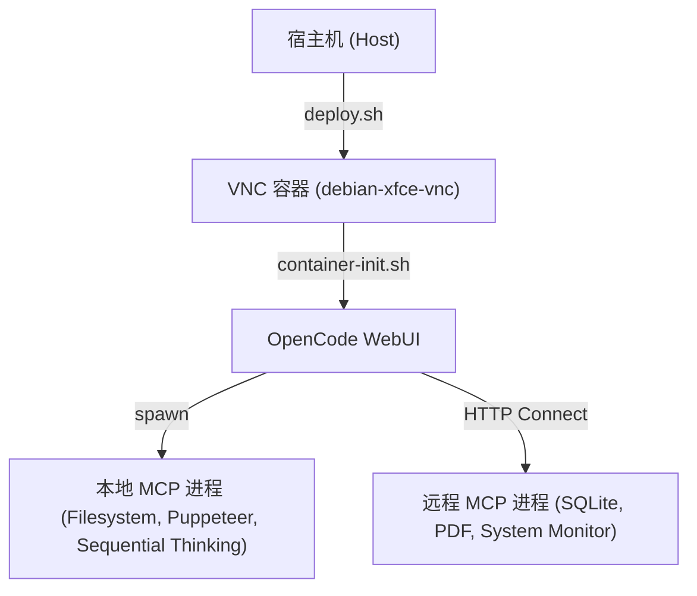

# 架构设计文档 - MCP 与开发环境配置

本文档描述了 Debian Xfce VNC 容器开发环境的 MCP (Model Context Protocol) 架构设计，以及最近的配置与依赖修复。

## 1. 架构概览

开发环境由宿主机（Host）和 Docker 容器（Container）组成。
- 宿主机通过 `deploy.sh` 脚本管理容器的生命周期与端口映射。
- 容器内部运行 `OpenCode WebUI` 服务，负责提供 AI 开发交互界面。
- MCP 服务分为 **Local**（本地加载进程）和 **Remote**（外部独立 HTTP 服务监听）两类服务。

---

## 2. 关键服务及运行配置

### 2.1 Node.js 运行环境 (Node 22 LTS)
- **现状与问题**：基础镜像自带的 Node.js 版本为 `v20.20.2`，该版本与较新版本的 `undici` 依赖存在严重的 WebIDL API 冲突（报错 `TypeError: webidl.util.markAsUncloneable is not a function`），导致 SQLite MCP 服务编译构建失败。
- **解决方案**：在容器初始化脚本 `container-init.sh` 中，增加了检测 Node.js 版本并自动升级至 Node 22 LTS (NodeSource) 的逻辑。

### 2.2 SQLite MCP 存储服务
- **包名称**：`@pepk/mcp-memory-sqlite`
- **运行模式**：Local (由 OpenCode 自动拉起，使用 Stdio 管道)。
- **持久化路径**：`/headless/.config/opencode/opencode.sqlite`

### 2.3 Puppeteer 浏览器自动化服务
- **运行模式**：Local (由 OpenCode 自动拉起)。
- **安全配置**：因为容器运行于 `root` 权限，默认的 Chromium 沙箱会报错导致启动失败。
- **解决方案**：在 `opencode.jsonc` 配置文件中为 `puppeteer` 配置注入环境变量：
  - `ALLOW_DANGEROUS: "true"`
  - `PUPPETEER_LAUNCH_OPTIONS: '{"args": ["--no-sandbox"]}'`

### 2.4 OpenCode 插件管理与优化
- **运行模式**：在 `/headless/.opencode/` 目录下管理全局 Node 项目及其 `node_modules`。
- **现状与问题**：
  - 原有机制通过 `opencode plugin <git-url>` 逐个安装 Git-based 插件，因 OpenCode 内部的 npm 包管理器对 Git 依賴處理有 Bug，經常報錯 `git dep preparation failed` 且耗時長。
  - 安裝後在 WebUI 面板會直接顯示含有 Git 網址的冗長套件名稱，視覺效果不夠精簡高級。
- **解决方案**：
  - 改用批量聲明依賴並在 `/headless/.opencode/` 執行 `bun install`。這會以 100% 成功率且數秒內完成所有插件及原生依賴的極速載入。
  - 將寫入 `/headless/.opencode/plugins.json` 的清單精簡為純淨、無網址的簡短包名。重啟 OpenCode 後，WebUI 即可載入命名乾淨、高雅清爽的插件列表。

### 2.5 OpenCode 安装源与本地 DEB 包集成
- **运行模式**：在 `container-init.sh` 中的 `setup_opencode` 函数中处理。
- **配置与优势**：
  - 优先检测本地挂载路径 `/headless/Desktop/config/opencode-desktop-linux-arm64.deb` 软件包。若存在，直接使用 `apt-get install -y` 极速完成离线安装与系统依赖自动补全，避免因网络波动或 GitHub API 限速导致的安装中断。
  - 自动为系统添加全局软链接 `/usr/bin/opencode -> /opt/OpenCode/ai.opencode.desktop`，保证命令行环境与后台 WebUI 服务调用的无缝无阻。
  - 若本地 DEB 包缺失，则平滑降级至在线 `curl` 脚本完成远程自动安装。
